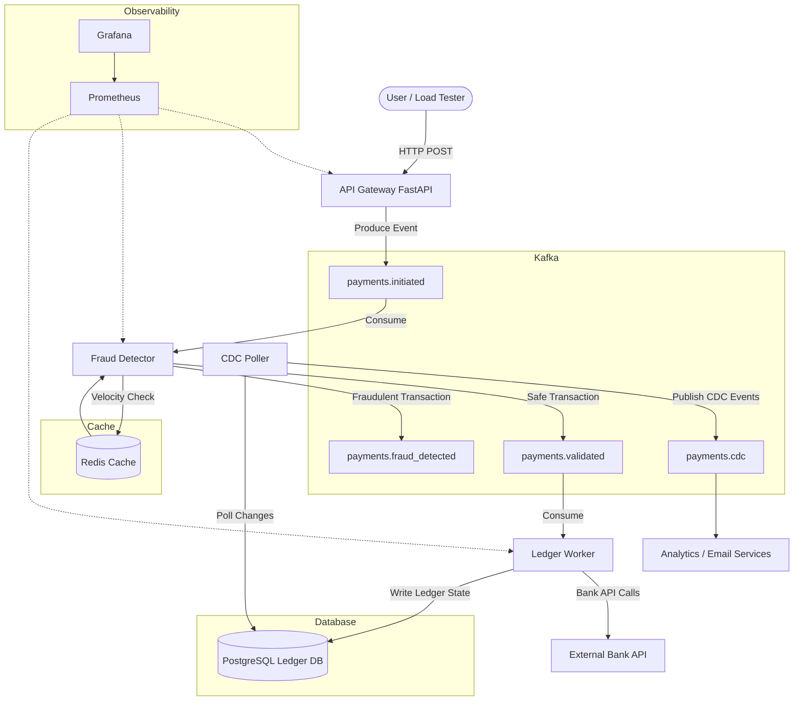

# Real-Time Payment Event Processing & Fraud Detection Middleware Platform

A distributed, event-driven middleware platform simulating enterprise-grade payment processing systems (similar to Visa, Stripe, or PayPal). This project demonstrates advanced distributed systems concepts, stream processing, high availability, and platform engineering best practices.

## 🚀 Architecture Overview

The platform decoupled into highly specialized microservices communicating asynchronously over Apache Kafka.

1. **Ingestion API (FastAPI)**: Highly available gateway that accepts payment requests, validates schema, attaches idempotency keys, and instantly pushes to Kafka.
2. **Stream Processor (Fraud Detector)**: A Flink-inspired stateful stream processor that consumes raw payments, checks velocity using a distributed cache (Redis), and routes transactions.
3. **Orchestrator (Ledger Worker)**: A Temporal-inspired worker that handles the "Saga". It manages simulated Bank API calls, exponential backoff retries, and strictly ordered writes to the PostgreSQL source-of-truth.
4. **Data Integration (CDC Poller)**: Simulates a Debezium-style outbox pattern by polling the database for finalized state changes and broadcasting them downstream.

Architecture diagram:



## 🛠 Tech Stack
* **Language:** Python 3.10+
* **Broker:** Apache Kafka & Zookeeper
* **Cache:** Redis (Stateful velocity checking)
* **Database:** PostgreSQL (Source of truth)
* **Observability:** Prometheus & Grafana (RED Metrics)
* **Orchestration:** Docker Compose & Kubernetes (Manifests included)
* **CI/CD:** GitHub Actions

## 🧠 Core Distributed Systems Concepts Demonstrated

* **Idempotency & Exactly-Once Semantics**: Prevents double-charging users during network retries using database constraints and manual Kafka offset management (`enable.auto.commit=False`).
* **Decoupling & Backpressure**: Using Kafka to buffer massive traffic spikes without crashing the downstream database.
* **Eventual Consistency**: Ensuring that the final settled state is asynchronously broadcasted via CDC.
* **Chaos Engineering Resilience**: The system can survive complete database outages, network partitions, and pod crashes without data loss.
* **Observability**: Prometheus RED metrics (Rate, Errors, Duration) for deep visibility.

## 🏃‍♂️ How to Run Locally

### 1. Install Dependencies
First, ensure your Python environment is set up:
```bash
python -m venv venv
source venv/bin/activate  # On Windows: venv\Scripts\activate
pip install -r requirements.txt
```

### 2. Automated Startup (Windows / PowerShell)
We have provided an automated startup script that boots the Docker infrastructure, waits for initialization, and spawns the Python microservices (FastAPI, stream processor, orchestrator, CDC, and load tester) in separate terminal windows for easy log monitoring.

Simply run:
```powershell
.\startup.ps1
```

### 3. Automated Shutdown (Windows / PowerShell)
To safely spin down the Docker infrastructure and kill the associated Python microservices, run:
```powershell
.\shutdown.ps1
```

### Manual Startup (Linux / Mac / Alternative)
If you prefer running services manually:
1. `docker compose up -d`
2. `uvicorn src.api.main:app --reload --port 8000`
3. `python -m src.processor.fraud_detector`
4. `python -m src.orchestrator.ledger_worker`
5. `python -m src.cdc.cdc_poller`
6. `python src/producer/load_test.py`

## 📊 Observability Dashboards
* **Kafka UI:** [http://localhost:8090](http://localhost:8090)
* **Prometheus:** [http://localhost:9090](http://localhost:9090)
* **Grafana:** [http://localhost:3000](http://localhost:3000)

## 📁 Project Structure
```text
├── k8s/                    # Kubernetes declarative manifests
├── config/                 # Prometheus configurations
├── src/
│   ├── api/                # FastAPI Gateway
│   ├── processor/          # Kafka Consumer & Redis Fraud Logic
│   ├── orchestrator/       # DB integration & Retry Logic
│   ├── cdc/                # Change Data Capture worker
│   └── producer/           # Load testing scripts
├── docker-compose.yml      # Local infra orchestration
└── .github/workflows/      # CI/CD Pipeline
```


